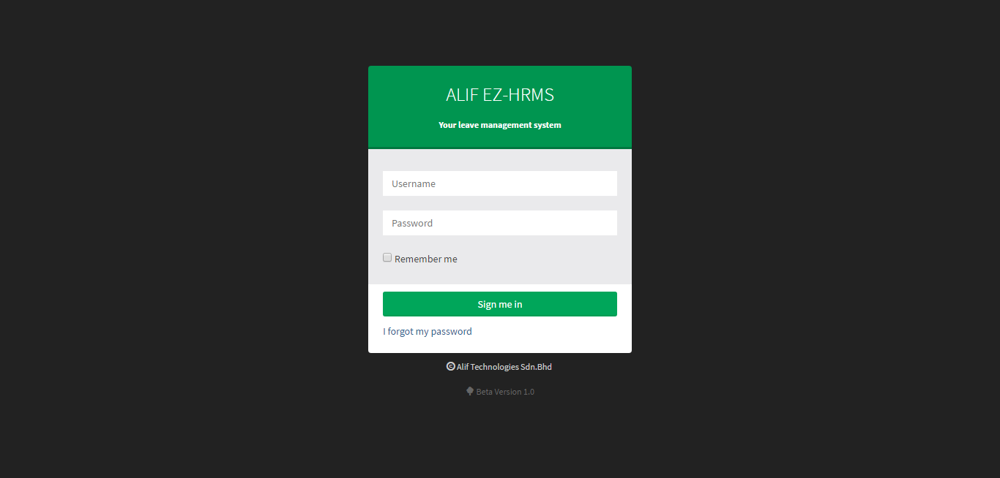
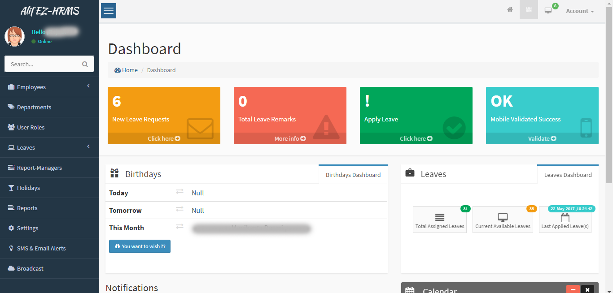
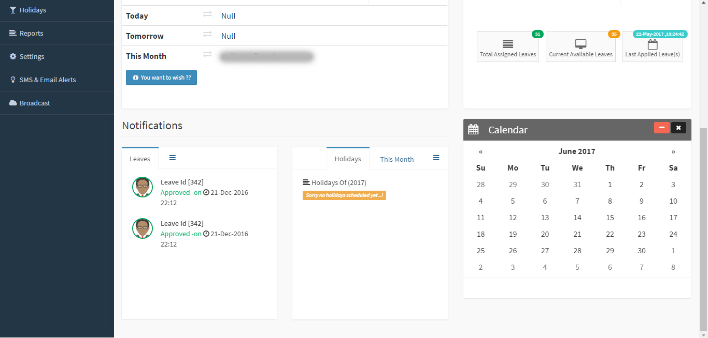
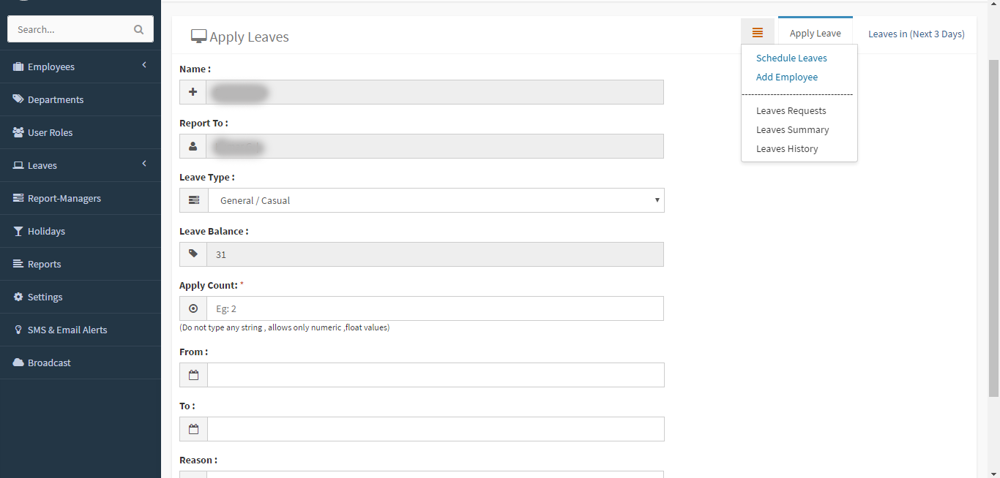
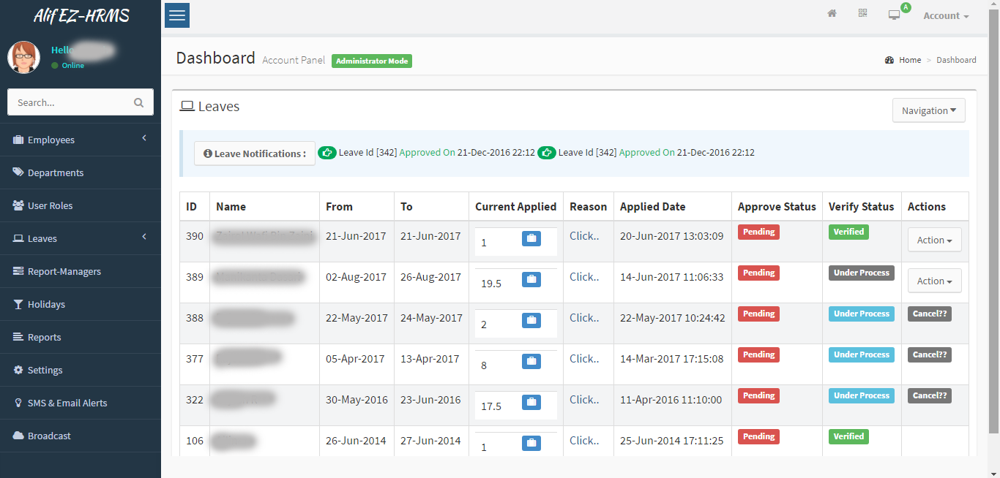
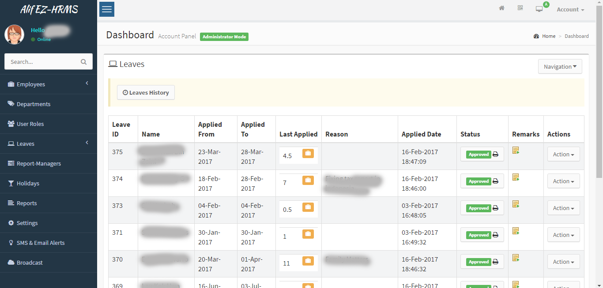
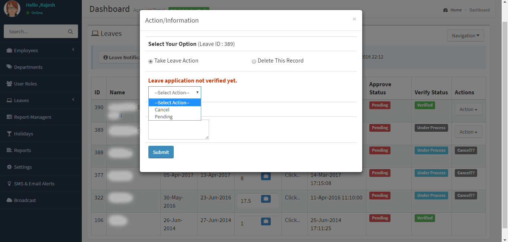
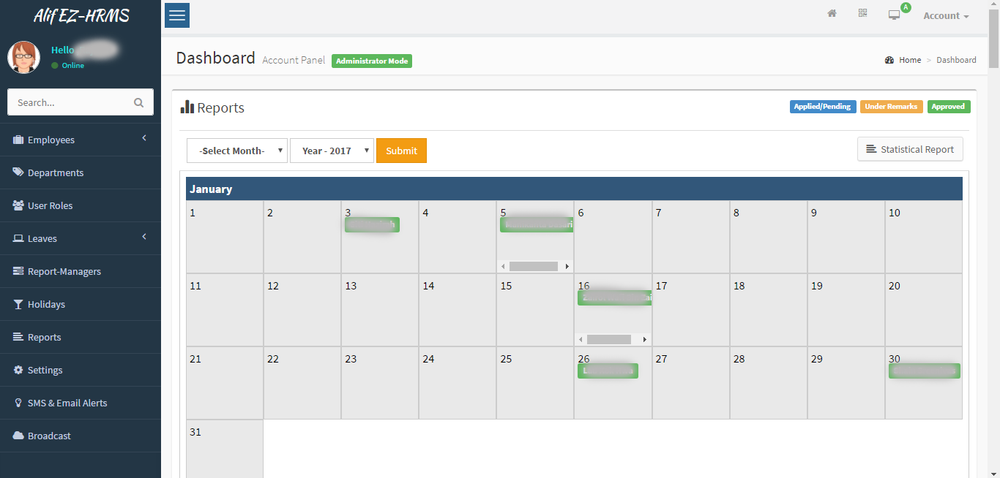

<h1>Project Name : EZHRMS (A Leave Management System) </h1> 
<table class="table table-striped">
<tr>
<td>
URL : <a href="http://bthrms.aliftechnologies.com/app/index.php">Click here </a> to visit EzHRMS
</td>

<td>
  EzHRMS also embeded with EzSupport (A Ticketing & Attendance system) <a href="http://support.aliftechnologies.com">Click here</a> to visit EzSupport
</td>
</tr>
</table>

<h3>Description :</h3>
<u>
<li>EzHRMS is a Leave management system developed for iternal/office usage ,at initial stage. 
But we gradually made EzHRMS as a enduser/ client's product. 
Today some of our clients are accessing same product by annual subscription.
</li>

<li>EzHRMS also embeded with EzSupport system (where it collaborated with attendance and support ticketing modules).</li>
<li>
 EzHRMS process executed in three stages 
 <ul>
  <li>1. Apply Leave</li>
  <li>2. Send to Verification Department (nothing but HR Dept)</li>
  <li>3. Approve/Decline by supervisor (upon null remarks from HR Dept)</li>
 </ul>
</li>
<li>Whenever staff applying for leave supervisor and HR department will get SMS/Email alerts.</li>
<li>Also staff can see leave status from his/her dashboard (employ's account)</li>
<li>When HR Department reviewed and put no remarks on leave application. 
Then It will be notifying (emai/sms)to applicant supervisor and supervisor</li>
<li>Whenever supervisor received no remarks then he/she can approve leave. 
Upon supervisor's approval applicant will receive a email/sms alerts.
</li>

<li>In what cases HR Department will send remarks? 
  <ul>
   <li>1. Exceed/paid leaves </li>
   <li>2. Mismatched dates </li>
   <li>3. Mismatched leave count (based on attendance). Attendance will be traced by EzSupport system. </li>
   <li>4. And other use cases</li>
  </ul>
</li>

<li>
  What happend if multiple (key/main) staff applying for leave in same time?
  <ul>
  <li>1. EzHRMS will prompt some messages to HR Department and Supervisors 
  about staff those who are taking leaves in next 2 days</li>
  <li>2. According to message supervisor/HR department can take decision to decline / adjust leaves.</li>
  </ul>
</li>

<li>
   How staff can validate their mobile number and why ?
  <ul>
  <li>1. Every staff should validate mobile number either Voice/SMS calls 
  </li>
  <li>2. If staff not validating mobile number he/she could not receive alerts.</li>
  </ul>
</li>

<li>EzHRMS also offering reports by Calendar / year/ by staff. </li>
</ul>

<h3>Major Modules By : </h3>
<table class="table table-striped" width="100%">
<tr>
 <td>Employ/Staff Portal</td>
 <td>Admin Portal</td>
 <td>HR/Verification Dept Portal</td>
 <td>Supervisor/Manager Portal</td>
</tr>

<tr>
<td style="vertical-align:top">
 
<ul>
 <li>Login</li>
 <li>Apply Leave</li>
 <li>Check Leave History</li>
 <li>Check Leave Count</li>
 <li>Cancel Leave</li>
 <li>Check Holidays</li>
 <li>Dashboard statistics</li>
 <li>Profile Management</li>
 
</ul>
</td>
 
<td>
<ul>
 <li>Login</li>
 <li>Users</li>
 <li>User Groups</li>
 <li>Employees (Add/Edit/Delete), All Employees/Details Logs </li>
 
 <li>
   Departments
   <ul>
   <li>Add/Edit</li>
   <li>All Departments</li>
   </ul>
 </li>
 <li>
   User Roles
   <ul>
   <li>Add/Edit Role</li>
   <li>All Roles</li>
   </ul>
 </li>
 <li>
   Leaves
   <ul>
   <li>Leave Requests</li>
   <li>Leave History</li>
   <li>Apply Leave</li>
   </ul>
 </li>
 <li>Reporting Manager/Supervisor (Assign/Remove)</li>
 <li>Holodays(Add/Edit/Delete/Search)</li>
 <li>
   Reports
   <ul>
   <li>By Calendar(year/Month)</li>
   <li>By Staff</li>
   </ul>
 </li>
 <li>Settings</li>
  
  
 <li>
   Broadcast
   <ul>
   <li>Email</li>
   <li>SMS</li>
   </ul>
 </li>
 
</ul>
</td>

<td>
  <ul>
 <li>Login</li>
 
 <li>Apply Leave</li>
 <li>Check Leave Requests (Take Action=> Approve/Decline)</li>
 <li>Check Leave History</li>
 <li>Check Leave Count</li>
 <li>Cancel Leave</li>
 <li>Check Holidays</li>
 <li>Dashboard statistics</li>
 <li>Profile Management</li>
 
</ul>
</td>

<td>
  <ul>
 <li>Login</li>
 
 <li>Apply Leave</li>
 <li>Verify Leave Requests (Take Action=> Remarks/approve)</li>
 <li>Check Leave History</li>
 <li>Check Leave Count</li>
 <li>Cancel Leave</li>
 <li>Check Holidays</li>
 <li>Dashboard statistics</li>
 <li>Profile Management</li>
 
</ul>
</td>
</tr>
</table>
 
<h3>Screens</h3>
 <table>
 <tr>
 <td>
 
 </td>
 <td>
 
 </td>
  <td>
 
 </td>
 <td>
 
 </td>
 </tr>

  <tr>
 <td>
 
 </td>
 <td>
 
 </td>
  <td>
 
 </td>
 <td>
 
 </td>
 </tr>
 
 </table>
