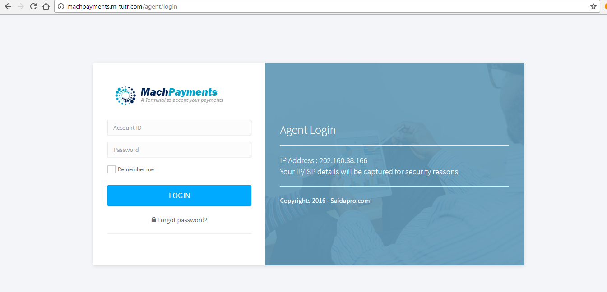
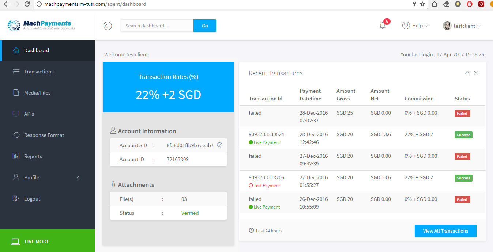
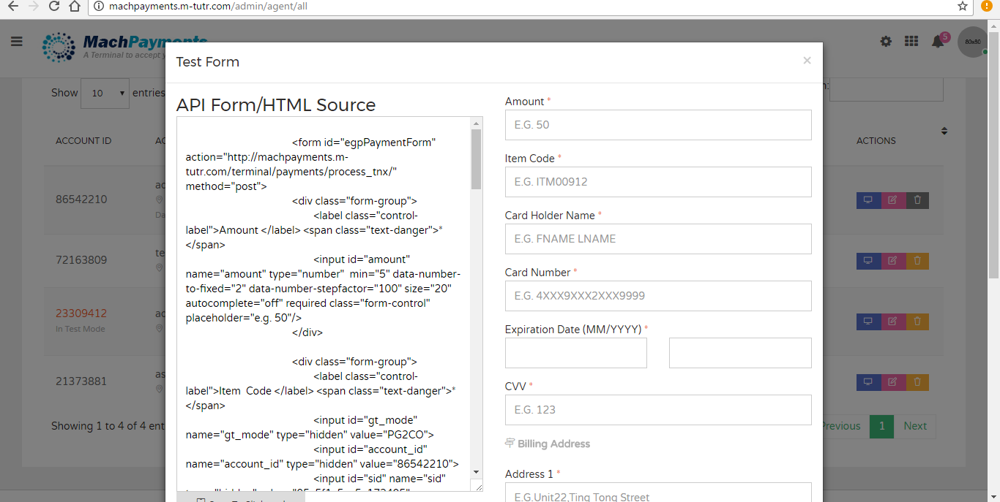
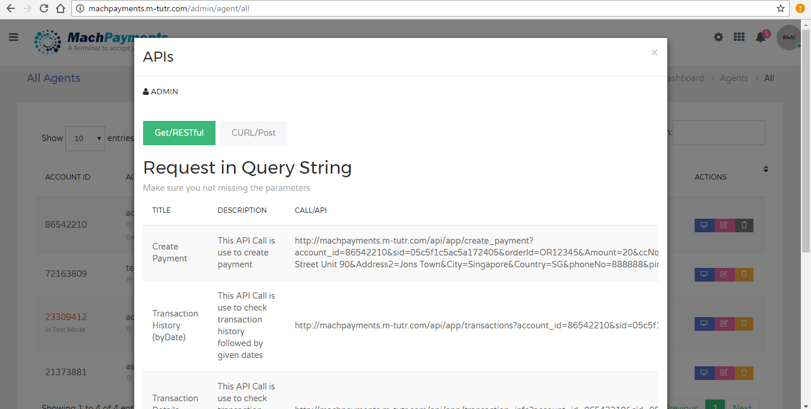
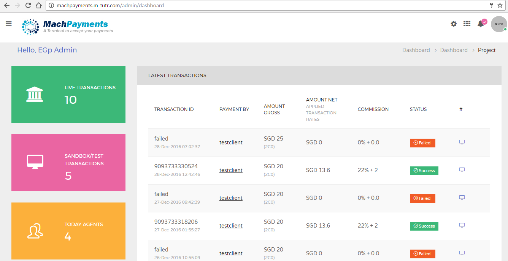
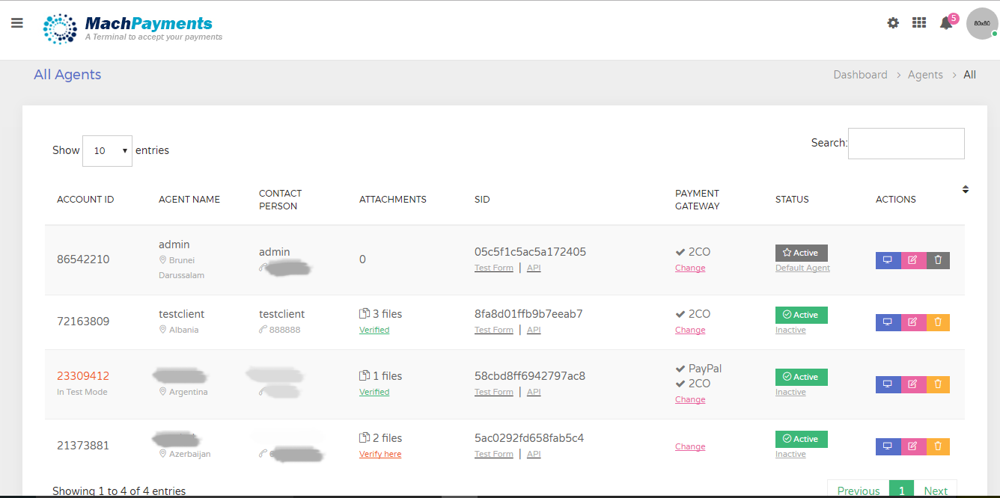
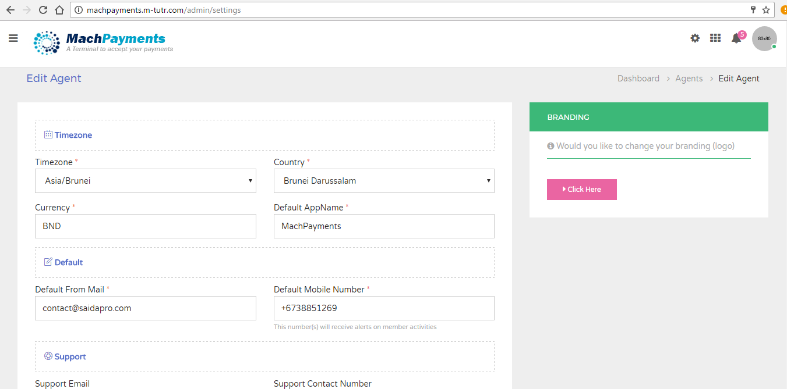
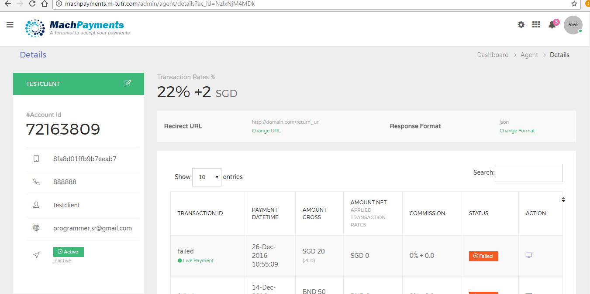

<h1>Project Name : Mach Payment Gateway (MPG) </h1> 
<table class="table table-striped">
<tr>
<td>
URL : http://machpayments.m-tutr.com/home 
</td>

<td>
 MPG Documentation (For third party integration) : <a href="https://github.com/saidasoft/v-dragon/blob/master/API-Document_MPayments.docx">Click here</a>
</td>
</tr>
</table>

<h3>Description :</h3>
<u>
<li>MPG (Machpayment Gateway) is a inhouse product, the whole concept was initiated/design 
and developed by me. </li>

<li>Using MPG vendors/consumer's can process payments through online .</li>
<li>MPG offers flexible (development tools) APIs/FORM widgets to integrate vendor/consumer's shopping cart applications. </li>
<li>MPG charges are very compitative in industry, we are offering different pricing to different country (in ASIA region).</li>
<li>MPG accepts online payments through debit/credit cards like VISA/Master, JCB, American Express,Paypal etc  </li>
<li>Process your payments using MPG is straight forward (in 3 easy steps). 
    <ul>
	 <li>1. Register and Verify Account </li>
	 <li>2. Integrate API/Form Widget </li>
	 <li>3. Get Response (Success/failed)- Done </li>
	</ul>
</li>
<li> Get MPG payouts using Bank Wire Transfers, upon withdraw requests (Monthly/Weekly).
Using client portal vendor/consumer can monitor all business transactions including withdraw requests.</li>
<li>
 MPG also offers solid reports on your transactions.
</li>
 
</ul>

<h3>Major Modules By : </h3>
<table class="table table-striped" width="100%">
<tr>
 <td>Agent/Vendor Portal</td>
 <td>Admin Portal</td>
</tr>

<tr>
<td style="vertical-align:top">
 
<ul>
 <li>Login/ Dashboard</li>

 <li>API Key</li>
 <li>Transactions Module</li>
 <li>Latest Transactions</li>
 <li>Reports </li>
 <li>Withdraw Modules</li>
 <li>Traffic Reports</li>
 <li>API Monitoring by Calls</li>
 <li>Media Module (For supporting documents)</li>
 <li>Test Mode/Live Mode</li>
  <li>Profile/Password Module</li>
 
</ul>
</td>
 
<td>
<ul>
 <li>Users</li>
 <li>User Groups</li>
 <li>Members (Add/Edit/Delete), All Members/Details Logs </li>
 <li>Blocklist/Whitelist Members</li>
 <li>API Agents</li>
 <li>Campaigns </li>
 <li>Payments</li>
 <li>
   Wallet Funds
   <ul>
   <li>Transactions</li>
   <li>Transaction by Member</li>
   <li>Refund Funds</li>
   <li>Transfer/Deposit Funds</li>
   <li>Rollback Funds</li>
   <li>Free Credit Requests</li>
   </ul>
 </li>
 <li>
   Caller Numbers
   <ul>
   <li>Assign Caller Number</li>
   <li>Block Caller Number</li>
   </ul>
 </li>
 <li>
   Sender ID/Masking
   <ul>
   <li>Approve/Terminate Sender ID</li>
   <li>Re-Approve Sender ID</li>
   </ul>
 </li>
 <li>SMS History (Reports)</li>
 <li>
   Promotions/Offers
   <ul>
   <li>Sed Email Campaign </li>
   <li>Send SMS Campaign</li>
   </ul>
 </li>
 <li>
   Notifications
   <ul>
   <li>Send Notification</li>
   <li>All Notifications/report</li>
   </ul>
 </li>
 <li>Enquires</li>
 <li>Geo Visitors</li>
 <li>
   Master Account
   <ul>
   <li>Caller Number Lookup</li>
   <li>Service Utility</li>
   </ul>
 </li>
 <li>Mini CMS</li>
 <li>
   Settings
   <ul>
   <li>App/Site Settings</li>
   <li>Payment Gateway</li>
   <li>SMS/VoIP Gateway</li>
   <li>Caller Numbers</li>
   <li>SMS Pricing</li>
   <li>Agent/Corporate SMS Pricing</li>
   <li>Account Classes</li>
   <li>Currency Settings</li>
   <li>Metadata Settings</li>

   </ul>
 </li>
 <li>Smart Notifications/Alerts</li>
 <li>Cron/Scheduling Jobs</li>
</ul>
</td>
</tr>
</table>
 
<h3>Screens</h3>
 <table>
 <tr>
 <td>
 
 </td>
 <td>
 
 </td>
  <td>
 
 </td>
 <td>
 
 </td>
 </tr>

  <tr>
 <td>
 
 </td>
 <td>
 
 </td>
  <td>
 
 </td>
 <td>
 
 </td>
 </tr>
 
 </table>
