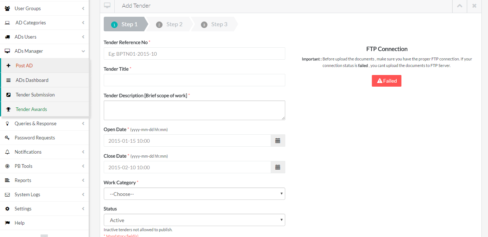

<h1>Project Name : TMS - Tender Management System</h1> 
<table class="table table-striped">
<tr>
<td>
URL : <a href="http://www.petroleumbrunei.com.bn/etenderuserguide.pdf">Click here</a> for  Bidder's Portal 
</td>

<td>
   Special Access Only (Restricted by PetroleumBrunei)
</td>
</tr>
</table>

<h3>Description :</h3>
<u>
<li>TMS is a online tender management system which is using by one of our client (PetroleumBrunei) . </li>

<li>TMS is highly potential and secured system to manage company tenders (privately) .</li>
<li>Its a tricky procedure interms opening tender and inviting bidders.</li>
<li>Tender management completed in five steps 
   <ul>
   <li>1. Create tender (it has again 3 steps)</li>
   <li>2. Assign/change SCE(Tender board secretary)</li>
   <li>3. Invite and bidders (Login credentials will be generated by system automatically followed by tender, and it get expires automatically when tender expires)</li>
   <li>4. Review tender submissions/Allow tender's queries-responses (Tender can be extended during this stage and notify to bidders - its optional)</li>
   <li>5. Award tender</li>
   </ul>
</li>
<li>TMS can handles all bidder's documentes securely (in FTP server).</li>
<li>TMS has extensive feature called locking documents during tendering stage, i.e nobody can see bidder's documents when tender is still open.</li>
<li>TMS offers queries/responses (discussion) during tendering stage. And it will send automatic notification to assigned SCEs.</li>
<li>Who is SCE, well SCEs are nothing but tender representatives those are assigned by system administrator or tender board secretary.</li>
<li>SCE are highly responsible in terms of monitoring tender and its activities.</li>
<li>How bidder can login to tender (on bidder portal), 
well whenever client opening tenders system will creates dynamic login credentials according to tender and it be delivered to bidder's email.</li>
<li>TMS also offers resend bidder's credentials/password when bidder forgot or not received their credentials.</li>
<li>TMS offers smart notifications on tender and bidder activities to administrator/SCE/ TBS (tender board secretary)</li>
<li>What happens if bidder is trying to login after tender expired, well in this case system will prompt alert message that bidder can't logon to system since respective tender credentials already expired. </li>

<li>
TMS has many other settings/permission options to control whole system.
</li>
</ul>

<h3>Major Modules By : </h3>
<table class="table table-striped" width="100%">
<tr>
 <td>Bidder's Portal</td>
 <td>Admin/SCE/TBS Portal (Based on permissions, can control system options)</td>
</tr>

<tr>
<td style="vertical-align:top">
 
<ul>
 <li>Login Module</li>
 <li>Download Tender Documents Module</li>
 <li>Tender Submission</li>
 <li>Tender Queries</li>
 <li>Tender Participates</li>
 <li>Profile/Password </li>
 <li>Alerts/Notifications</li>
</ul>
</td>
 
<td>
<ul>
 <li>Users (Add/Edit/Delete)</li>
 <li>User Groups (Add/Edit/Delete)</li>
 <li>
   Bidders (Add/Edit/Delete)
    <ul>
	 <li>Activate/Deactivate Bidder</li>
	 <li>Bidder's Tender History </li>
	 <li>Bidder's Media (FTP Documents)</li>
	 <li>Search/Export/Import Bidder</li>
	</ul>   
 </li>
 
 <li>Tender/Ad Categories (Add/Edit/Delete)</li>
 <li>
   Tender/Ad Manager
    <ul>
	 <li>
	   Post Tender/ad 
	   <ol>
	   <li>Basic Information</li>
	   <li>Manage SCE</li>
	   <li>Manage Tender/Ad Documents</li>
	   </ol>
	 </li>
	 
	 <li>
	  Tender Dashboard
	  <ol>
	   <li>Bidder Invitations, Credentials</li>
	   <li>Extend Update tender</li>
	   <li>Manage TBS and SCE</li>
	  </ol>
	 </li>
	 
	 <li>
	   Tender Submission
	  <ol>
	   <li>Media Document Management (including locking)</li>
	   <li>Manage bidder submissions </li>
	   <li>Manage Queries/Accept, Decline Responses</li>
	  </ol>
	 
	 </li>
	 <li>Tender Awarding</li>
	</ul>   
 </li>
 
 <li>
   Queries and Responses
   <ul>
   <li>Post a Response (followed by Tender)</li>
   <li>Queries/Response (multiple) management</li>
   </ul>
 </li>
 <li>
  Password Requests 
  <ul>
   <li>Request monitoring</li>
   <li>Generate and resend credentials (by Mail)</li>
   </ul>
 </li>
 <li>
  Notifications
   <ul>
   <li>Document change notifications</li>
   <li>General Notifications</li>
   <li>Tender extended </li>
   <li>Tender cancellation </li>
   <li>Tender invitations </li>
   <li>Document download notifications </li>
   <li>Query/response notifications </li>
   <li>User creation/update notifications </li>
   </ul>
 </li>
 <li>
   PB tools
   <ul>
   <li>Logcode manager</li>
   <li>Typecode management</li>
   <li>Mail manager</li>
   </ul>
 </li>
 
 <li>
    Reports
   <ul>
   <li>Tender/bidder reports </li>
   </ul>
 </li>
 
 
 <li>
   Audit Logs
   <ul>
   <li>System logs </li>
   <li>Latest Logs</li>
   <li>All Logs</li>
   </ul>
 </li>
  
 <li>Account Management</li>
  
 <li>
   Settings
   <ul>
   <li>Group Settings</li>
   <li>Email Settings</li>
   <li>FTP Settings</li>
   <li>SMS Settings</li>
   </ul>
 </li>
 <li>Profile management</li>
 <li>Help documents</li>
</ul>
</td>
</tr>
</table>
 
<h3>Screens</h3>
 <table>
 <tr>
 <td>
 
 </td>
 <td>
 
 </td>
  <td>
 
 </td>
 <td>
 
 </td>
 </tr>

  <tr>
 <td>
 
 </td>
 <td>
 
 </td>
  <td>
 
 </td>
 <td>
 
 </td>
 </tr>
 
  <tr>
 <td>
 
 </td>
 <td>
 
 </td>
  <td>
 
 </td>
 <td>
 
 </td>
 </tr>
 
 </table>
